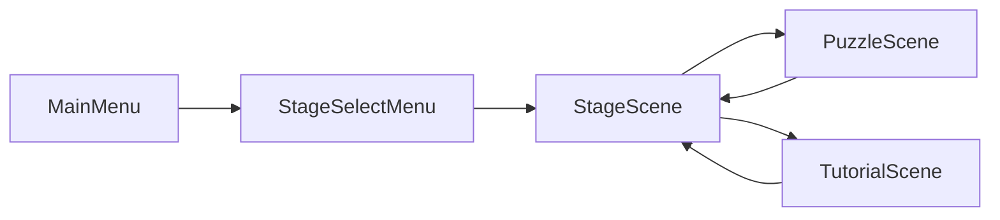

# Electric Road

Electric Road는 타일을 배치해 하나 이상의 발전기와 모든 공장을 연결하고, 가능한 한 적은 비용으로 전력망을 완성하는 2D 퍼즐 게임이다.

플레이어는 경로를 드래그해 전선을 놓거나 팔레트에서 특수 타일을 선택할 수 있다. 모든 공장에 전력이 도달하면 사용 비용에 따라 별 1~3개를 획득한다.

## 프로젝트 현황

- Unity 버전: `6000.4.6f1`
- 렌더링: Universal Render Pipeline 2D
- 기본 화면: 800×375, 가로 방향
- 정식 지역: Village, Town, City
- 정식 퍼즐: 지역별 10개, 총 30개
- 대상 플랫폼 코드: Steam, Stove, Android
- 저장 방식: 로컬 JSON
- 자동화 테스트: 현재 없음

## 시작하기

1. Unity Hub에서 저장소 루트를 Unity 프로젝트로 연다.
2. Unity `6000.4.6f1` 또는 호환되는 Unity 6 버전을 사용한다.
3. 패키지와 에셋 임포트가 끝날 때까지 기다린다.
4. `Assets/Scenes/Build/MainMenu.unity`를 연다.
5. Play Mode로 게임 흐름을 실행한다.

플랫폼 SDK 초기화 없이 퍼즐만 개발할 경우 현재 Build Profile과 조건부 컴파일 심볼을 먼저 확인한다.

## 게임 흐름



- `MainMenu`: 시작, 설정, 크레딧, 종료
- `StageSelectMenu`: Village, Town, City 선택
- `StageScene`: 지역의 튜토리얼과 퍼즐 목록 표시
- `PuzzleScene`: 일반 퍼즐 플레이
- `TutorialScene`: 단계별 안내와 연습 맵

## 플레이 방식

퍼즐 편집에는 세 가지 모드가 있다.

- Draw: 마우스나 터치로 경로를 드래그해 직선과 코너를 자동 배치한다.
- Select: 팔레트 타일을 선택하고 방향 또는 전기 타입을 지정한다.
- Erase: 편집 가능한 타일을 초기 상태로 되돌린다.

배치와 삭제는 Undo/Redo할 수 있다. 자세한 판정 규칙은 [게임 규칙](docs/GAMEPLAY_RULES.md)을 참고한다.

## 디렉터리 구조

```text
Assets/
├─ Scenes/
│  ├─ Build/                 # 실제 빌드에 포함되는 씬
│  └─ Dev/                   # 스테이지 제작 및 개발용 씬
├─ Scripts/
│  ├─ Command/               # 타일 배치 명령과 Undo/Redo
│  ├─ GameStage/             # 지역별 퍼즐 선택 화면
│  ├─ ScriptableObjects/     # 타일·퍼즐·지역 데이터 모델
│  ├─ Stage/                 # 퍼즐 플레이와 편집 모드
│  ├─ StageBuilder/          # 에디터용 레벨 제작 도구
│  ├─ Tutorial/              # 튜토리얼 진행
│  ├─ UI/                    # 메뉴와 퍼즐 UI
│  └─ Utility/               # 오디오, 싱글턴, 자료구조
├─ ScriptableObjects/
│  ├─ GameStage/             # Village, Town, City 묶음
│  ├─ PuzzleStage/           # 정식·샘플 퍼즐 데이터
│  ├─ Tile/                  # 타일 종류와 비용
│  └─ Tutorial/              # 튜토리얼 단계와 연습 맵
├─ Prefabs/
├─ Localize/
└─ Settings/
```

## 핵심 문서

- [AI 작업 지침](AGENTS.md)
- [게임 규칙](docs/GAMEPLAY_RULES.md)
- [프로젝트 아키텍처](docs/ARCHITECTURE.md)
- [레벨 제작 가이드](docs/LEVEL_AUTHORING.md)

## 주요 의존성

- Odin Inspector: 2차원 스테이지 데이터 직렬화와 인스펙터
- DOTween: UI와 결과 애니메이션
- Unity Localization: 튜토리얼 다국어 문자열
- Steamworks.NET: Steam 초기화와 업적
- Stove PC SDK: Stove 로그인과 업적
- Google Mobile Ads: Android 전면 광고
- Standalone File Browser: 에디터 스테이지 파일 선택

외부 플러그인 소스는 `Assets/Plugins`, `Assets/GoogleMobileAds`, `Assets/ExternalDependencyManager` 등에 있다.

## 저장과 진행도

각 퍼즐 ScriptableObject의 에셋 이름을 키로 사용해 최고 별 개수를 저장한다.
지역 내 이전 퍼즐을 클리어하면 다음 퍼즐이 해금된다. 플랫폼에 따라 사용자 식별자를 포함한 경로에 JSON 파일이 생성된다.

## 개발 시 유의사항

- 런타임 정답은 `answerMap`과의 일치 여부가 아니라 전력 연결과 비용으로 판정한다.
- 스테이지 맵은 Odin이 직렬화한 2차원 배열이므로 Unity 에디터를 통해 편집하는 것이 안전하다.
- 타일 비용 변경은 모든 정식 스테이지 밸런스에 영향을 준다.
- 정식 콘텐츠에는 기본형과 증폭기형 퍼즐만 사용 중이다.
- 저장 키가 에셋 이름에 의존하므로 퍼즐 에셋 이름 변경은 기존 진행도 호환성을 깨뜨릴 수 있다.
