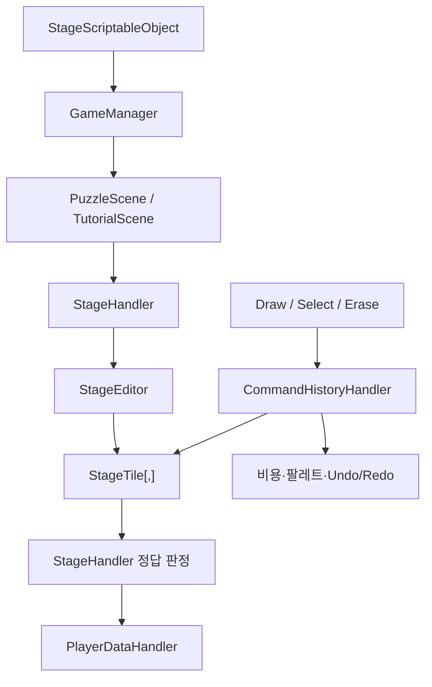
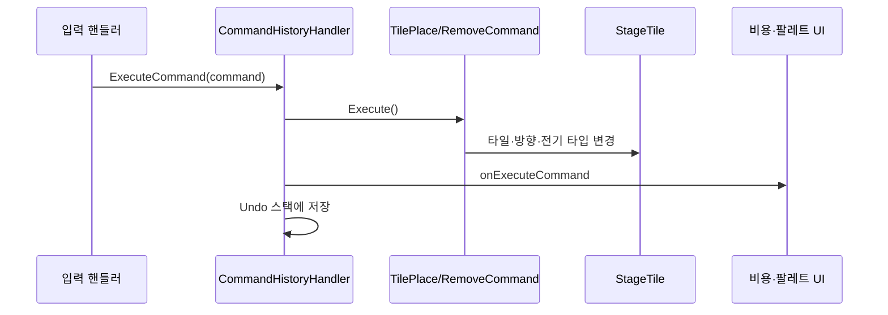

# Electric Road 아키텍처

## 개요

Electric Road는 하나의 공용 퍼즐 씬에 ScriptableObject 스테이지 데이터를 주입하는 구조다.
씬 전환 상태는 `GameManager`가 유지하고, `StageHandler`가 선택된 데이터를 실제 타일 오브젝트로 변환해 플레이를 시작한다.



## 씬 구조

Build Settings에는 다음 씬이 순서대로 등록되어 있다.

| 씬 | 역할 | 주요 컴포넌트 |
|---|---|---|
| `MainMenu` | 앱 진입점 | `GameManager`, `PlayerDataHandler`, 플랫폼·광고 관리자 |
| `StageSelectMenu` | 지역 선택 | `StageSelector`, `StageComponent` |
| `StageScene` | 지역별 퍼즐 선택 | `GameStageHandler`, `PuzzleComponent` |
| `PuzzleScene` | 일반 퍼즐 플레이 | `StageHandler`, 편집 핸들러, Command 시스템 |
| `TutorialScene` | 튜토리얼 플레이 | 퍼즐 시스템 + `TutorialHandler` |

`GameManager`는 `SceneManager.sceneLoaded` 이벤트를 구독한다. 씬이 로드되면 이름으로 대상 관리자 오브젝트를 찾고 현재 데이터를 전달한다.

## 상위 데이터 모델

### GameStageDataScriptableObject

전체 지역 목록과 전체 퍼펙트 클리어 업적 키를 가진다.

```text
GameStagesData
├─ VillageGameStage
├─ TownGameStage
└─ CityGameStage
```

### GameStageScriptableObject

한 지역의 메타데이터다.

- 지역 이름과 썸네일
- 10개의 `StageScriptableObject`
- 퍼즐 선택 UI 프리팹
- 지역 BGM
- 튜토리얼 유무와 데이터
- 지역 클리어 및 퍼펙트 클리어 업적 키

### StageScriptableObject

하나의 퍼즐을 표현한다.

| 필드 | 의미 |
|---|---|
| `stageName` | 화면에 표시할 퍼즐 이름 |
| `stageType` | 사용할 전력 판정 규칙 |
| `width`, `height` | 맵 크기 |
| `generatorPositions` | 모든 발전기 좌표 |
| `generatorPos` | 기존 에셋 호환용 단일 발전기 좌표 |
| `numOfFactories` | 공급해야 할 공장 수 |
| `map` | 플레이 시작 시 생성할 초기 맵 |
| `answerMap` | 제작 도구가 저장한 참고 정답 |
| `ans` | 제작 시 계산된 정답 비용 |
| `numOfPalate` | 해금할 팔레트 타일 수 |
| `thresholds` | 3성, 2성, 1성 비용 상한 |
| 업적 필드 | 개별 퍼즐 업적과 비용 조건 |

`map`과 `answerMap`은 Odin Inspector가 직렬화하는 `TileStruct[,]`다. 각 셀은 방향, 타일 데이터 참조, 전기 타입을 가진다.

`MakeMapByStageTiles`는 초기 맵에서 모든 발전기 좌표를 찾아 `generatorPositions`에 저장하고 첫 좌표를 호환용 `generatorPos`에도 기록한다. 런타임은 저장된 목록을 우선 사용하고, 목록이 없는 기존 에셋만 `generatorPos`로 대체한다.

## 런타임 시스템

### GameManager

`GameManager`는 씬이 바뀌어도 유지되는 전역 관리자다.

- 현재 지역과 퍼즐 데이터 보관
- 일반 퍼즐, 다음 퍼즐, 재시작, 튜토리얼 로드
- 씬 로드 후 `StageHandler`, `GameStageHandler`, `TutorialHandler` 설정
- 지역 및 전체 클리어 업적 확인
- Windows 창 비율과 메인 BGM 관리

현재 `LoadNextPuzzle`의 지역 종료 조건은 10개로 고정되어 있다.

### StageEditor

이름과 달리 런타임 퍼즐 씬에서도 그리드 생성기로 사용된다.

1. 기존 타일 오브젝트를 제거한다.
2. 스테이지 높이에 맞는 타일 프리팹 크기를 선택한다.
3. `map[x, y]`를 순회해 `StageTile`을 생성한다.
4. 빈 타일은 편집 가능하게, 고정 타일은 편집 불가능하게 설정한다.

`StageBuilder`는 개발용 정답 탐색기이며 `StageEditor`와 역할이 다르다.

`StageBuilder.FindAnswer`는 현재 씬 맵을 `beginStage`로 먼저 캡처한다. 공장이 하나면 각 발전소에서 공장까지의 경로만 탐색하고 가장 저렴한 후보를 적용한다. 다른 발전소 타일은 경유할 수 없다. 공장이 여러 개면 비용이 큰 자동 탐색을 생략하고 초기 맵만 유지하므로, 제작자가 정답 경로를 수동 편집해야 한다.

`StageBuilder.MakeStageFile`은 캡처한 `beginStage`를 초기 맵으로, 현재 씬 맵을 정답 맵으로 저장한다. 초기 맵을 캡처하지 않은 상태에서는 저장하지 않는다.

### StageHandler

퍼즐 플레이의 중심 컴포넌트다.

- 스테이지 초기화
- 현재 비용과 별 임계값 관리
- 정답 검사 중 입력 잠금
- 스테이지 타입별 전력 탐색
- 타일 활성화 연출
- 결과 팝업, 별 저장, 업적 처리

정답 검사 시 저장된 발전기 위치 목록의 범위, 중복 여부와 실제 발전기 타일을 검증한다. 발전소별 DFS는 병렬 또는 다중 시작점 방식으로 합치지 않고 하나씩 순차 실행한다. 하나의 발전소 탐색이 끝나면 같은 방문 맵을 유지한 채 다음 발전소 탐색을 시작한다.

### 입력과 편집 모드

`EditModeHandler`가 세 입력 시스템을 배타적으로 활성화한다.

| 모드 | 담당 | 동작 |
|---|---|---|
| Draw | `WireTileHandler` | 드래그 경로를 직선·코너·분배기로 자동 배치 |
| Select | `TileHandler` | 팔레트 타일, 방향, 전기 타입 선택 |
| Erase | `EraseHandler` | 편집 가능한 타일 삭제 |
| Stop | 없음 | 정답 검사 중 입력 비활성화 |

### Command 시스템

타일 변경은 Command 패턴을 사용한다.



`StageHandler`는 Command 이벤트로 비용을 갱신하고, `TileHandler`는 같은 이벤트로 팔레트 사용량을 갱신한다. 따라서 타일을 직접 수정하면 관련 상태가 동기화되지 않을 수 있다.

### 전선 드래그

`WireTileHandler`는 입력 상태를 `IDLE`, `ON_TRACK`, `ON_PLACE`로 관리한다.

- 드래그한 타일을 순서가 있는 컬렉션에 저장한다.
- 대각선, 중복 방문, 편집 불가능한 경로를 거부한다.
- 이전 위치와 다음 위치를 비교해 직선 또는 좌·우 코너를 선택한다.
- 기존 선에서 새 경로가 시작되면 시작 타일을 분배기로 바꾼다.
- 각 타일 배치를 Command로 실행한다.

## 전력 판정

`StageType`에 따라 별도 메서드가 호출된다.

| 타입 | 구현 | 정식 콘텐츠 사용 |
|---|---|---|
| `DEFAULT` | 연결된 모든 공장 도달 | Village, Town |
| `AMPLIFIER` | 제한 거리 내 이동, 증폭기에서 거리 회복 | City |
| `MODULATOR` | 전기 타입 변환 및 공장 타입 일치 | 샘플·튜토리얼 |
| `AMP_MOD` | 거리와 전기 타입을 함께 처리 | 샘플 코드 |

경로 진입 가능 여부는 대상 타일 종류와 방향으로 결정된다. 탐색을 시작한 발전기와 분배기는 여러 방향으로 분기하고, 일반 선과 코너는 저장된 방향에 따라 다음 칸 하나로 진행한다.

발전기는 시작 전용 타일이다. A 발전소에서 시작한 전력은 B 발전소에 진입하거나 B 발전소를 경유할 수 없다.

모든 발전소의 순차 탐색은 좌표 단위 방문 맵 하나를 공유한다. 현재 발전소에서 갈라진 분기나 후속 발전소의 탐색이 이미 방문한 타일에 도달하면 전기 타입이나 남은 전력 거리와 관계없이 정답 검사를 즉시 실패시킨다. 따라서 발전소별 `VisitMap`이나 상태별 방문 맵을 별도로 만들지 않는다.

## UI와 진행도

### 비용 UI

`CostSlider`는 세 임계값을 네 구간으로 나누어 현재 비용을 표시한다. `StageHandler.onCostChange` 이벤트와 씬에서 연결된다.

### 퍼즐 해금

`GameStageHandler`는 퍼즐 목록을 순서대로 처리한다.

- 클리어 기록이 있으면 저장된 별을 표시한다.
- 첫 미클리어 퍼즐은 플레이 가능하다.
- 그 이후 퍼즐은 잠긴다.
- 튜토리얼이 있는 지역은 첫 UI 항목을 튜토리얼에 사용한다.

### 저장

`PlayerDataHandler`는 `Dictionary<string, string>`을 JSON으로 저장한다.

- 키: `StageScriptableObject.name`
- 값: 해당 퍼즐에서 획득한 최고 별 개수
- Steam/Stove 빌드에서는 사용자 식별자를 저장 경로에 반영한다.
- 저장 파일의 상위 디렉터리가 없으면 `SaveData`가 파일 쓰기 전에 생성한다.

에셋 이름을 바꾸면 기존 저장 키와 달라질 수 있다.

## 튜토리얼

`TutorialScriptableObject`는 순서가 있는 `TutorialUnitScriptableObject` 목록이다.
각 단계는 다국어 문자열 키, 선택적인 연습 맵, `isClearAble` 필드, 안내 애니메이션 프리팹을 가진다.
현재 `TutorialHandler`는 `isClearAble`을 판정에 사용하지 않고 마지막 단계인지 여부로 정답 검사를 허용한다.

`TutorialHandler`는 단계가 바뀔 때 다음 작업을 수행한다.

1. Localization 테이블에서 제목과 설명을 가져온다.
2. 단계별 애니메이션을 전환한다.
3. 필요하면 `StageHandler.stageData`를 다른 연습 맵으로 교체한다.
4. 마지막 단계에서만 정답 검사를 허용하도록 스테이지를 초기화한다.

## 플랫폼과 보조 시스템

- `PlatformManager`: Steam 또는 Stove 관리자 활성화
- `SteamAchievement`, `StoveAchievementHandler`: 업적 해금
- `AdManager`, `AdMobHandler`: Android 전면 광고
- `SoundManager`: BGM과 SFX 풀 관리
- Unity Localization: 한국어, 영어, 일본어, 중국어 간체·번체

## 알려진 구조적 제약

- 모든 게임 코드가 사실상 기본 `Assembly-CSharp`에 속한다.
- EditMode와 PlayMode 자동 테스트가 없다.
- `StageHandler`의 스테이지 타입별 탐색 코드가 상당 부분 중복된다.
- 좌표 단위 `visit` 배열은 서로 다른 잔여 전력이나 전기 타입 상태를 구분하지 않는다.
- `StageBuilder.ApplyAmplifier`와 `ApplyModulator`는 구현되지 않았다.
- 일부 런타임 파일의 에디터 전용 네임스페이스 참조는 플레이어 빌드 시 점검이 필요하다.
